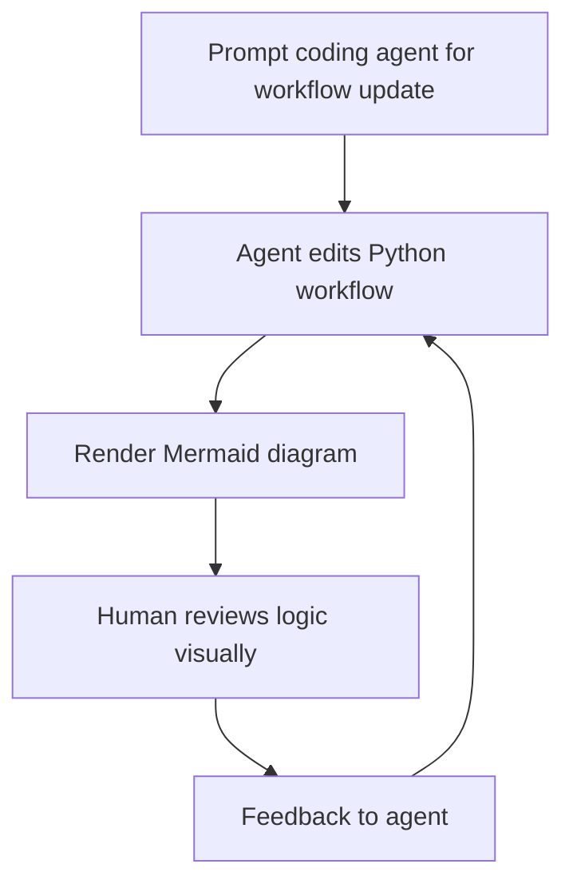

We are making a major product decision in Orcheo Canvas: moving away from visual drag-and-drop workflow authoring as the primary authoring mode, and embracing vibe-coding workflows in Python.

Yes, this comes at a moment when the visual authoring experience is nearly done.

That sounds counterintuitive, so this post explains exactly why we are doing it.

## The short version

Drag-and-drop workflow editing is built for humans. To make it truly good, we need to continuously optimise readability, ergonomics, form UX, validation UX, debugging UX, and interaction design at scale. All of that effort serves a single end goal: helping teams create optimised workflows and update them when needed.

That work is real engineering work, but it is not the highest-leverage path for where workflow development is going.
From first principles, the goal is not to preserve a specific authoring interface, but **to help teams build and update optimised workflows with the least friction over time.**

The future is agent-assisted coding. In that world, Python (or other languages, like TypeScript) source becomes the most scalable interface for creating, evolving, reviewing, and versioning workflows.

## Why give up visual authoring now, when it is almost finished?

Because "almost finished" is different from "cheap to maintain and evolve."

What has changed is the quality of coding agents. Over the past year, AI-assisted coding crossed a threshold where agents can reliably generate, refactor, and iterate on structured Python code from natural-language intent. That shift makes the maintenance cost of a bespoke visual editor much harder to justify.

Once you commit to visual authoring as the core workflow interface, the long tail never ends. You are not just building a graph editor. You are building and maintaining:

- a node canvas interaction system (selection, drag/drop, edge behaviour, collision, shortcuts, undo/redo)
- search and navigation affordances for large graphs
- panel architecture for editing, execution history, trace inspection, readiness checks, and settings
- schema-driven form systems for many node families and backend types
- validation and remediation flows (connection errors, node config errors, credential errors)
- error state language that helps users fix issues quickly
- performance tuning for large, real-world workflows
- state synchronisation across graph state, runtime state, metadata, and UI state

We learned this directly while building Canvas. Even relatively simple UX improvements can cascade into non-trivial work across tabs, shared state wiring, form schemas, and validation paths.

## The pain points of human-first drag-and-drop systems

Here are the recurring pain points that pushed us toward a code-first direction:

1. **Comprehension overhead grows with graph size**  
Visual workflows look approachable at small scale, then become harder to scan and reason about as branches and cross-links multiply.

2. **Configuration UX becomes a product of its own**  
Node configuration requires many schemas, UI schema overrides, custom widgets, and special-case handling. That complexity compounds over time.

3. **Validation UX is expensive to get right**  
Users need precise, actionable feedback for invalid connections, missing credentials, and node misconfiguration. Generic errors are not enough.

4. **Debugging spans multiple interaction surfaces**  
In practice, users jump between editor, execution history, traces, readiness checks, and settings. Even good tab design still fragments attention.

5. **State orchestration gets complicated quickly**  
A visual authoring UI has to keep graph edits, runtime traces, inspection state, and collaboration-safe persistence aligned, without surprising behaviour.

6. **Small UX bugs have outsized impact**  
Event propagation edge cases, focus behaviour, drag targets, and action conflicts can make the system feel unreliable even when core logic is correct.

7. **Version control and review are weaker than code-native workflows**  
Graph diffs are harder to review than source diffs. Collaboration quality drops when changes are not easy to inspect line by line.

None of this means visual editors are "bad." It means they are expensive to perfect, and that expense competes directly with higher-leverage investments — agent-assisted workflow generation, SDK ergonomics, and runtime observability.

## Why vibe-coding is the better default now

Vibe-coding changes the economics of workflow development.

When workflows are authored in Python with coding agents:

- developers stop spending time on repetitive drag-and-drop operations
- agents can generate and refactor workflow code faster than humans can manually rewire graphs
- workflows become naturally versionable, diffable, and reviewable
- testability improves because source is explicit and scriptable
- teams can scale changes across many workflows with standard code tooling

In short: less UI manipulation, more system design.

## Visuals are still valuable: Mermaid as the review surface

Moving away from drag-and-drop authoring does not mean moving away from visualisation.

We still believe diagram views are extremely useful for spotting logic bugs, branch structure mistakes, or unintended cycles. Mermaid fits naturally here: it renders code-defined flows as visual sanity checks without requiring a separate editor to maintain.

A practical loop looks like this:

That gives us the best of both worlds: code as the source of truth, diagrams as fast verification.

## What comes next in Orcheo Canvas

We are exploring a dedicated vibe-coding page in Canvas to make this workflow even more accessible, including for non-technical users.

The goal is straightforward:

- users describe intent in natural language
- coding agents synthesise or update Python workflows
- Canvas provides guardrails, previews, and visual checks
- users iterate through guided prompts instead of manual graph editing

For example, a user might type *"add a retry with exponential backoff after the API call node"* and the coding agent updates the workflow source, re-renders the Mermaid diagram, and presents the change for review — all without opening a single configuration panel.

This is not about removing users from the loop. It is about moving human effort to the highest-value part: defining intent, reviewing architecture, and making product decisions.

## Closing thought

Drag-and-drop authoring helped us learn what workflow users need.

Vibe-coding helps us deliver those outcomes faster, with better maintainability, and with stronger alignment to where software development is already heading.

For Orcheo Canvas, this is not a step back from usability. It is a step forward in leverage.
